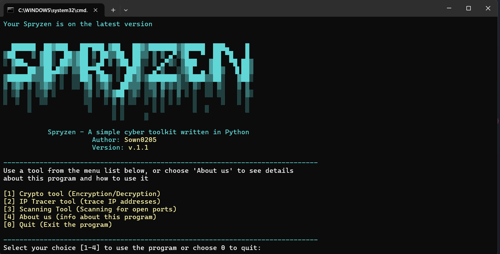
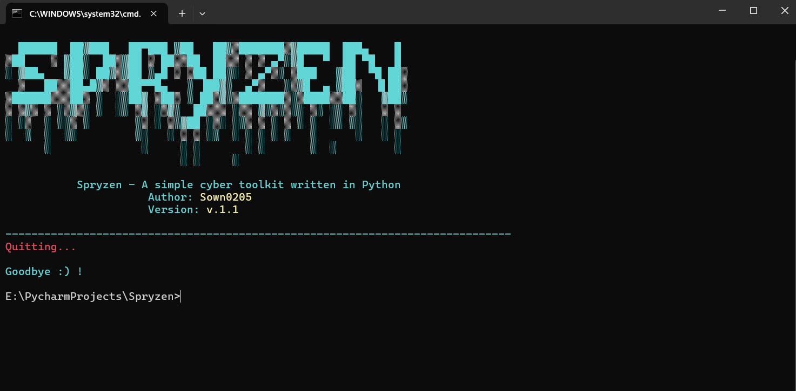

# Spryzen

A simple cyber toolkit written in Python

Author: Sown0205

## About this program

Spryzen is a simple cyber toolkit contains 3 main tools: A cryptography tool, an IP tracer tool, and a scanning tool.


Image 1: Spryzen UI

[1] The cryptography tool can be used to encrypt and decrypt file with AES-256-CBC encryption method that generates a random 32-bit encryption key.

[2] The IP tracer tool can be used to trace IP address information from a target IP address using IPinfo API.

[3] The scanning tool can be used to scan TCP opened or closed ports on a target IP address (usually our own IP address)

[4] Users can also choose 'About us' to read more about this program, its features and how to use it

If they want to quit the program, select [0] to exit


Image 2: Exitting Spryzen

## How to use

To use this toolkit, users can clone the git repo for this toolkit

```bash
git clone https://github.com/Sown0205/Spryzen.git
```

To fully utilize all of the tools in this program, users must install required Python libraries, such as:

+ cryptography: The main Python library for cryptography tool
+ requests: Handles requests for IP tracer tool
+ scapy: A powerful packet manipulation library used in the scanning tool

Users also have to meet some requirements to run this program, such as available Python interpreter and pip (python package installer)

You can install these manually in your terminal, or you can run our bash script 'install.sh' to automate all the process.

```bash
sudo bash install.sh
```

Now your Spryzen is fully configured and you can run this 
```bash
python spryzen.py  

or

sudo python spryzen.py
```
to use the toolkit

<span style="color:yellow">Caution: The scanning tool requires highest access to run, as scanning ports smaller than 1024 (priviliged ports) requires highest access to do this.</span>

<span style="color:yellow">If users try to run the scanning tool without highest access, it will return PermissionError</span>

<span style="color:yellow">Solution: Use highest access if you want to use the scanning tool</span>

<span style="color:yellow">+ To do this in Windows: Run the program as Administator (highest access)</span>

<span style="color:yellow">To do this in macOS - Linux: Use root access (sudo)</span>

Optional: If you want to create shortcut or run the program in anywhere instead of the git repo folder, you can run this bash script: 'execute.sh'. This script will create a sym link to run the program without calling the Python interpreter
```bash
sudo bash execute.sh
```
then you can run this
```bash
sudo spryzen
```

## Technical details

### 1. Cryptography tool

- Use built-in Python library named cryptography

- AES-256-CBC encryption mode with 32-bit encryption key

- Users will input files, the program encrypts the file and add a '.enc' extension, then deletes the original file to delete tracks

- The encryption key then can be saved into a text file, and users can later use it for decryption

- The tool has file validation, input validation, key validation, and many more. 

### 2. IP Tracer tool
- A simple ip tracer tool that use requests library from Python to send requests to IPinfo API.

- Users will prompt their target IP address, the progam then will send a requests to API to return data for that IP address in json format

- If success (status code = 200), the program will fetch the data and filter it to display each data field (name, country, geological location, hostname, postal, and timezone)

- Else (status code != 200), it will simply return an error

### 3. Scanning tool
- Use scapy library to manipulate network packets

- Users will prompt IP address, choose to scan port/ports (e.g 22,80,445) or port range (e.g 1-1000), enter their target port/ports/range.

- The program then will perform a SYN scan on targeted ports. It first sends a SYN packet to a port. 

   - If the program received a SYN-ACK packet (flag = 0x12), then the port is OPENED, and the program will send a RST to close it immidiately

   - If received a RST-ACK packet (flag = 0x14), then the port is CLOSED

   - If not received anything, the port is considered filtered or no response, and it will not be displayed

- The program then will collected the results list then display it.

- To make things faster, the scan process also has a multi-threading function that can be used to scan multiple ports at time

### 4. Others
- An updater function that compare the program's version and the current version ob Github. If the version does not match, the program needs an update. And if users wants to update, Spryzen will do it automatically

- <span style="color:yellow">Caution: This features is still in development and it can cause some bugs. It is recommended that you shouldn't use this feature right now until later version

## Other informations

This is a personal project for learning programming and cybersecurity

It's not meant for real-world security use

But you can play with it to understand how things work!

It's open source. Pull requests are welcome! Feel free to contribute

## Future updates
Spryzen current version is v.1.1. In our next version update, v.1.2, there will be some new features such as:

+ Enhancing UI display with Python rich library (our UI code is pretty messy and not efficient enough)

+ Use ThreadPoolExecution for scanning program to boost speed rather than traditional multi-threading


## Contact information
- Gmail: buithaison13579@gmail.com
- Facebook: https://www.facebook.com/son.bui.5730
- GitHub: https://github.com/Sown0205


